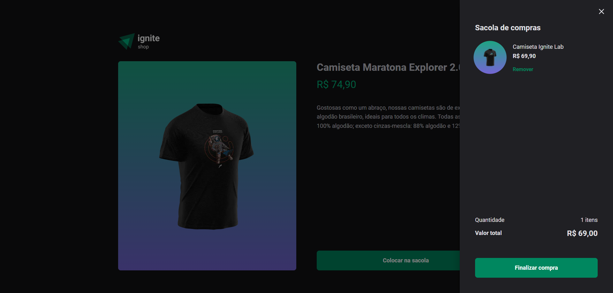

<h1 align="center"> Ignite Shop | Ignite </h1>

Projeto desenvolvido através de um desafio do 5º módulo "Primeiro Framework" do programa Ignite da Rocketseat 

  <a href="#-tecnologias">Tecnologias</a>&nbsp;&nbsp;&nbsp;|&nbsp;&nbsp;&nbsp;
  <a href="#-projeto">Projeto</a>&nbsp;&nbsp;&nbsp;|&nbsp;&nbsp;&nbsp;
  <a href="#-licença">Licença</a>

  

## 🚀 Tecnologias

Esse projeto foi desenvolvido com as seguintes tecnologias:

- React
- ContextAPI
- Stitches
- Typescript
- Next
- Integração com Stripe

## 💻 Projeto

O projeto é um e-commerce com uma listagem de camisetas, camiseta específica, adicionar ao carrinho e realizar o checkout dos produtos no carrinho que trabalha com conceitos de renderização via servidor (SSR e SSG)

Os principais objetivos do projeto eram:

[x] Listagem das camisetas no catálogo do Stripe.

[x] Adicionar uma camiseta ao carrinho.

[x] Remover uma camiseta do carrinho.

[x] Conferir camisetas adicionadas no carrinho.

[x] Integração com o checkout do stripe e redirecionamento para página de sucesso.

## 🔘 Licença

Esse projeto está sob a licença MIT.

---

Made with 💙 by Rafael Ramos
